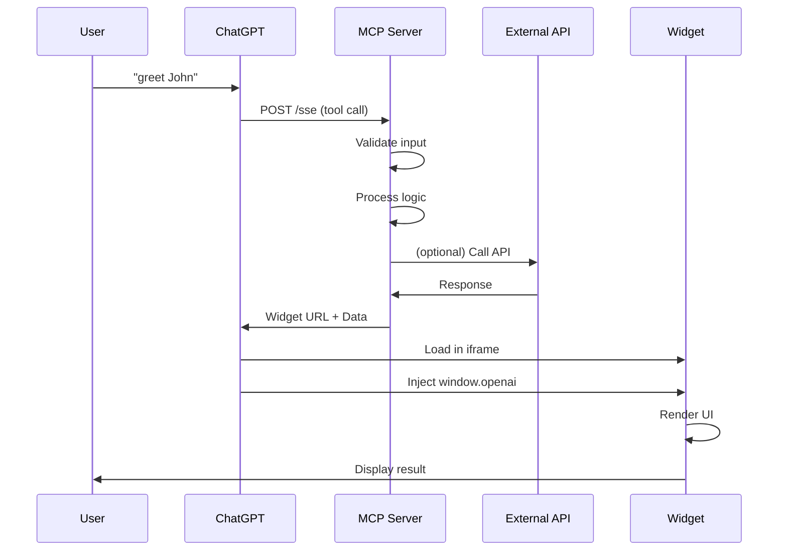
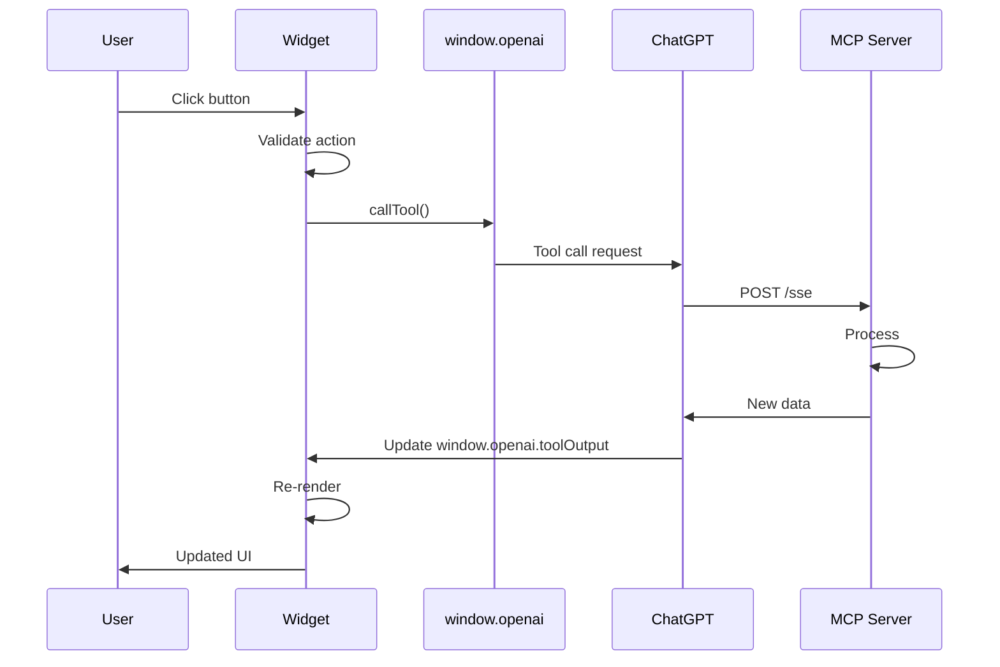

# ChatGPT Widget Architecture

## Overview

ChatGPT widgets use a **two-component architecture** with strict separation of concerns:

1. **Widget** (Cloudflare Pages) - Static UI assets
2. **MCP Server** (Cloudflare Workers) - Business logic and tool handling

## Why Separation Matters

### The Problem with Monolithic Approaches

❌ **Don't do this:**
```
MCP Server
├── /widget endpoint (serves HTML)
├── /api endpoint (handles requests)
└── /sse endpoint (ChatGPT connection)
```

Problems:
- Mixed responsibilities
- Harder to deploy
- Can't leverage CDN for static assets
- Larger bundle sizes
- Slower cold starts

### The Correct Approach

✅ **Do this:**
```
ChatGPT ──(SSE)──> MCP Server (Workers)
                        │
                        │ (returns widget URL)
                        ↓
                   Widget URL (Pages)
                        │
                        │ (loads in iframe)
                        ↓
                   User's Browser
```

Benefits:
- Clear separation of concerns
- CDN-optimized static assets
- Faster widget loading
- Easier to update independently
- Better scalability

## Communication Flow

### 1. User Invokes Tool in ChatGPT

```
User: "Use greet_user with name 'John'"
```

### 2. ChatGPT Calls MCP Server

```
POST https://mcp-server.workers.dev/sse
{
  "method": "tools/call",
  "params": {
    "name": "greet_user",
    "arguments": { "name": "John" }
  }
}
```

### 3. MCP Server Processes Request

```typescript
// mcp-server/src/index.ts
server.setRequestHandler(CallToolRequestSchema, async (request) => {
  const result = await handleTool(request.params.arguments);

  return {
    content: [{
      type: "resource",
      resource: {
        uri: WIDGET_URL, // Points to Cloudflare Pages
        mimeType: "text/html",
        text: JSON.stringify(result), // Data for widget
      },
    }],
  };
});
```

### 4. ChatGPT Loads Widget

```
ChatGPT receives:
  uri: "https://widget.pages.dev"
  data: { "greeting": "Hello, John!", "timestamp": "..." }

ChatGPT creates iframe:
  <iframe src="https://widget.pages.dev" />

ChatGPT injects data:
  window.openai.toolOutput = { "greeting": "Hello, John!", ... }
```

### 5. Widget Renders with Data

```typescript
// widget/src/App.tsx
const toolData = useToolData(); // Reads window.openai.toolOutput

return (
  <div>
    <h1>{toolData.greeting}</h1>
    <p>{formatDateTime(toolData.timestamp)}</p>
  </div>
);
```

## Component Responsibilities

### Widget (Cloudflare Pages)

**Responsibilities:**
- Render UI
- Display tool output
- Handle user interactions
- Responsive design
- Theme support
- Client-side validation

**What it DOESN'T do:**
- Business logic
- API calls (except through window.openai.callTool)
- Data persistence (uses window.openai.setWidgetState)
- Authentication

**Technologies:**
- React + TypeScript
- Tailwind CSS
- Vite
- Deployed as static HTML/CSS/JS

### MCP Server (Cloudflare Workers)

**Responsibilities:**
- Tool registration
- Input validation
- Business logic
- API integration
- Error handling
- Data transformation

**What it DOESN'T do:**
- Serve widget HTML
- Render UI
- Handle DOM events

**Technologies:**
- TypeScript
- @modelcontextprotocol/sdk
- Cloudflare Workers runtime

### Shared Types

**Responsibilities:**
- Type definitions
- Input/output schemas
- Validation rules
- window.openai API types

**Used by:**
- Widget (compile-time types)
- MCP Server (compile-time types)

## Data Flow

### Tool Invocation



### User Interaction



## Deployment Architecture

### Cloudflare Pages (Widget)

```
┌─────────────────────────────────────┐
│     Cloudflare Global CDN          │
│                                     │
│  ┌──────────────────────────────┐  │
│  │   Static Assets              │  │
│  │   - index.html               │  │
│  │   - bundle.js (React app)    │  │
│  │   - styles.css               │  │
│  └──────────────────────────────┘  │
│                                     │
│  Fast, cached, global delivery     │
└─────────────────────────────────────┘
```

**Advantages:**
- Global CDN
- Instant cache
- No cold starts
- Automatic HTTPS
- Automatic scaling

### Cloudflare Workers (MCP Server)

```
┌─────────────────────────────────────┐
│   Cloudflare Workers Network        │
│   (300+ cities worldwide)           │
│                                     │
│  ┌──────────────────────────────┐  │
│  │   Worker Script              │  │
│  │   - Tool handlers            │  │
│  │   - SSE transport            │  │
│  │   - Business logic           │  │
│  └──────────────────────────────┘  │
│                                     │
│  Edge compute, low latency         │
└─────────────────────────────────────┘
```

**Advantages:**
- Edge computation
- Low latency
- Automatic scaling
- Pay-per-request
- Built-in secrets management

## Security Model

### Widget Security

**Runs in ChatGPT iframe:**
- Sandboxed environment
- No access to localStorage
- No access to document.cookie
- No access to parent window
- Limited to window.openai API

**Must:**
- Escape all user input
- Validate URLs before opening
- Use window.openai.setWidgetState for persistence

### MCP Server Security

**Cloudflare Workers:**
- Isolated execution
- No file system access
- Secrets via wrangler secrets
- CORS properly configured

**Must:**
- Validate all inputs
- Sanitize outputs
- Rate limit requests
- Use HTTPS only

## State Management

### Client-Side State (Widget)

```typescript
// Ephemeral UI state
const [loading, setLoading] = useState(false);

// Persistent widget state (across sessions)
const [favorites, setFavorites] = useWidgetState<string[]>([]);

// Tool output data (from MCP server)
const toolData = useToolData();
```

### Server-Side State (MCP Server)

```typescript
// Cloudflare KV (persistent storage)
await env.KV.put(key, value);

// Cloudflare Durable Objects (real-time coordination)
const obj = env.DURABLE_OBJECT.get(id);

// External databases
await fetch('https://api.example.com/db', { ... });
```

## Performance Considerations

### Widget Performance

**Goals:**
- First paint < 1s
- Interactive < 2s
- Bundle size < 200KB gzipped

**Strategies:**
- Code splitting
- Lazy loading
- Tree shaking (automatic with Vite)
- Minimize dependencies

### MCP Server Performance

**Goals:**
- Response time < 500ms
- Cold start < 100ms

**Strategies:**
- Keep worker code small
- Minimize dependencies
- Use KV cache
- Optimize API calls

## Error Handling

### Widget Errors

```typescript
// Error boundary (React errors)
<ErrorBoundary>
  <App />
</ErrorBoundary>

// User-facing errors
if (toolData.error) {
  return <ErrorState message={toolData.message} />;
}

// Development mode
if (!toolData) {
  return <DevMode />;
}
```

### MCP Server Errors

```typescript
try {
  const result = await processRequest(args);
  return { success: true, data: result };
} catch (error) {
  console.error("Tool error:", error);
  return {
    error: true,
    message: "Failed to process request",
    code: "EXECUTION_ERROR",
  };
}
```

## Scaling Considerations

### Widget Scaling

**Handled by Cloudflare:**
- Automatic CDN scaling
- No configuration needed
- Global distribution
- DDoS protection

### MCP Server Scaling

**Handled by Cloudflare:**
- Automatic horizontal scaling
- No configuration needed
- Pay-per-request billing
- No cold start penalties (after first request)

## Best Practices

### Do's ✅

- Separate widget and server concerns
- Use TypeScript for type safety
- Validate inputs on both client and server
- Handle errors gracefully
- Support light and dark themes
- Make widgets responsive
- Test in all display modes
- Document your schemas

### Don'ts ❌

- Don't serve widget from MCP server
- Don't use localStorage in widgets
- Don't skip input validation
- Don't hardcode secrets
- Don't ignore display modes
- Don't assume fixed dimensions
- Don't skip error states
- Don't use inline styles (use Tailwind)

## Summary

The two-component architecture provides:

1. **Clear separation** - Widget (UI) vs Server (logic)
2. **Better performance** - CDN for static assets, edge compute for logic
3. **Easier deployment** - Independent deployments
4. **Better scalability** - Automatic scaling on both sides
5. **Simpler debugging** - Clear boundaries
6. **Type safety** - Shared types between components

This architecture follows ChatGPT's recommended patterns and leverages Cloudflare's infrastructure for optimal performance and reliability.
